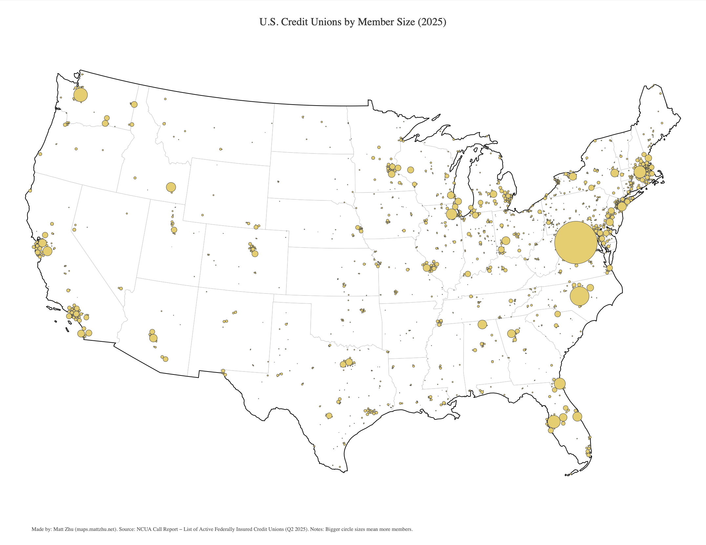
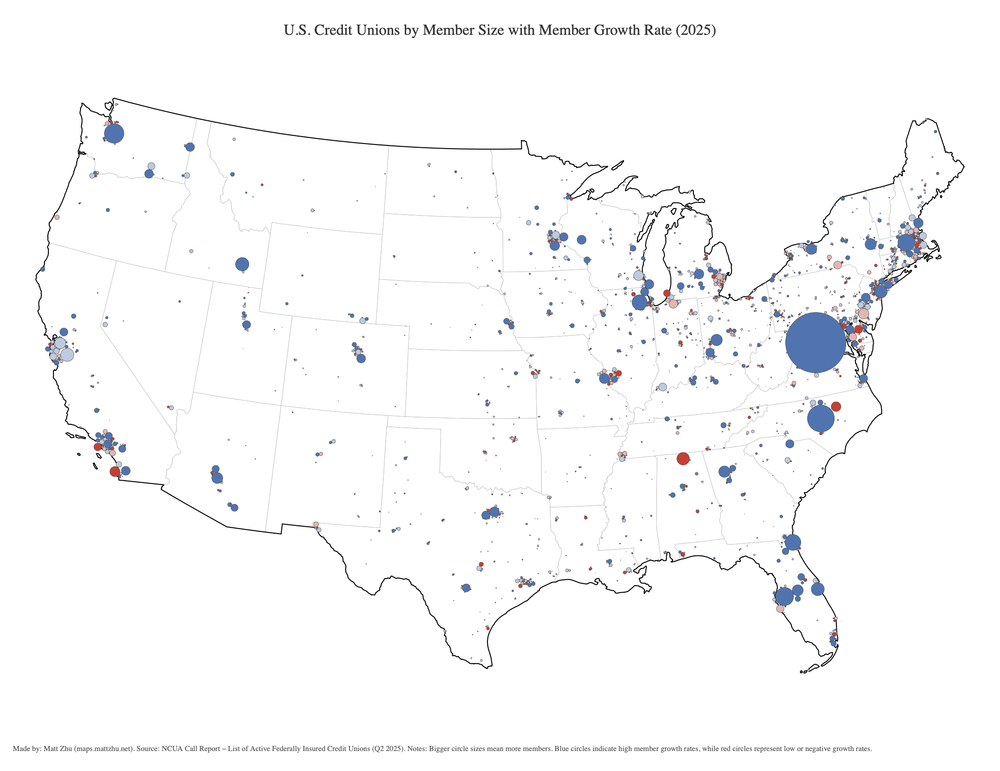

### Day 1 - Points
**[Challenge Description](https://30daymapchallenge.com/#:~:text=Challenge%20Classic%3A%20Map%20with%20point%20data%20(e.g.%2C%20individual%20locations%2C%20points%20of%20interest%2C%20clusters).%20Focus%20on%20effective%20symbolization%20and%20density%20visualization.):** Visualize point-based data such as individual locations, points of interest, or clusters. Focus on symbolization and density representation.

### My Submission

Maps visualizing **U.S. credit unions**, where each packed circle represents a credit union.  
- **Circle size** corresponds to **member size**.  
- **Circle color** indicates **member growth rate** — blue for higher growth, red for lower or negative growth.

### References  
- Tutorial: [How to Make a Cartogram with Packed Circles in R](https://flowingdata.com/2024/04/17/how-to-make-a-cartogram-with-packed-circles-in-r/)  
- Source Data: [NCUA Credit Union Call Report Data](https://ncua.gov/analysis/credit-union-corporate-call-report-data)

*Made by [Matt Zhu](https://mattzhu.net) for the [#30DayMapChallenge](https://30daymapchallenge.com/).*
