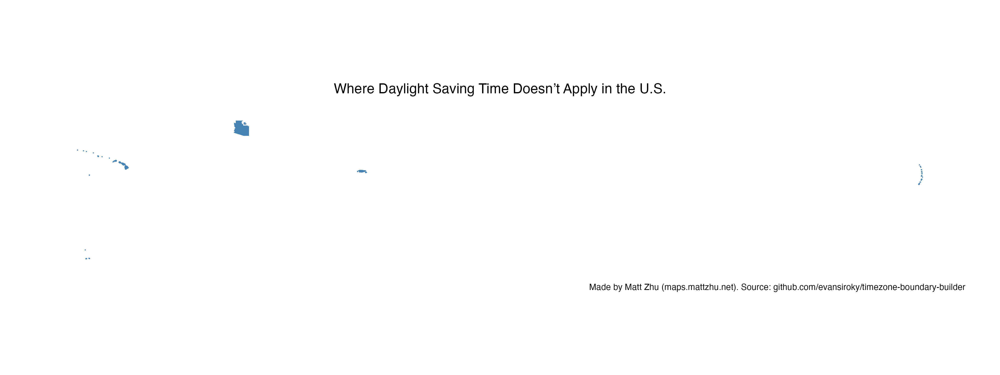
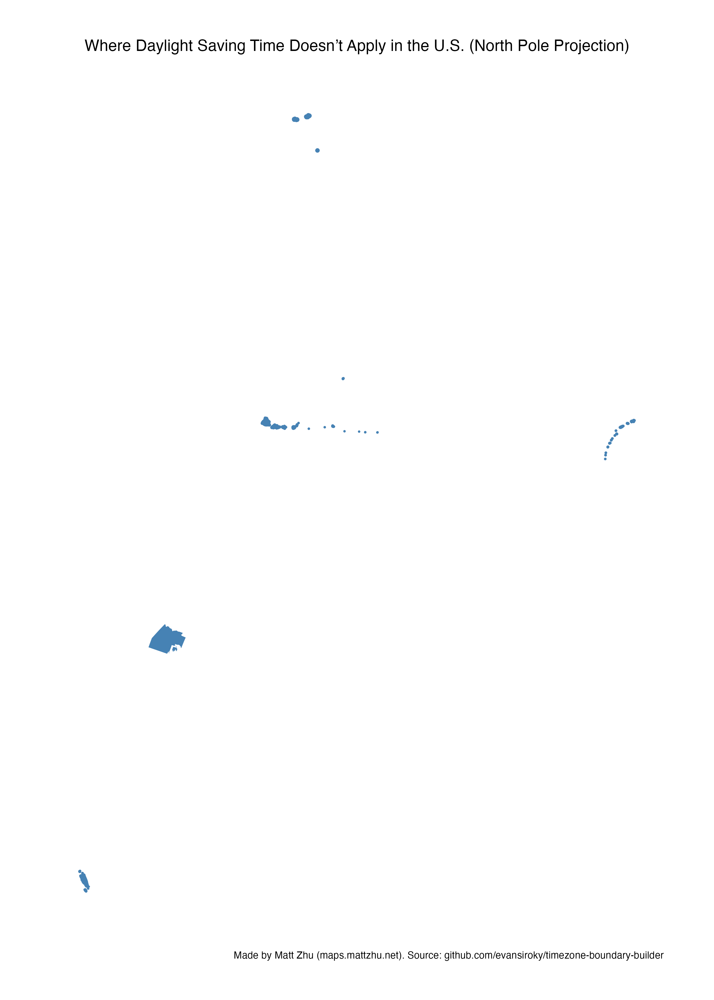

### Day 11 - Minimal
**[Challenge Description](https://30daymapchallenge.com/#:~:text=Challenge%20yourself%20to%20use%20the%20fewest%20possible%20elements%20(color%2C%20line%20weight%2C%20labels)%20while%20keeping%20the%20map%20clear%2C%20useful%2C%20and%20informative.):** Challenge yourself to use the fewest possible elements (color, line weight, labels) while keeping the map clear, useful, and informative.

### My Submission

**Where Daylight Saving Time Doesn't Apply in the U.S.**

A minimal visualization showing areas in the United States that don't observe Daylight Saving Time, including:
- **Hawaii**
- **Most of Arizona** (except the Navajo Nation)
- **U.S. territories** in the Pacific and Caribbean

[Click here to view high-quality PDF ⬆️](../assets/non-dst-us.pdf)

[Click here to view high-quality PDF ⬆️](../assets/non-dst-us-polar.pdf)

### References  
- Source Data: [Timezone Boundary Builder](https://github.com/evansiroky/timezone-boundary-builder)

*Made by [Matt Zhu](https://mattzhu.net) for the [#30DayMapChallenge](https://30daymapchallenge.com/).*
