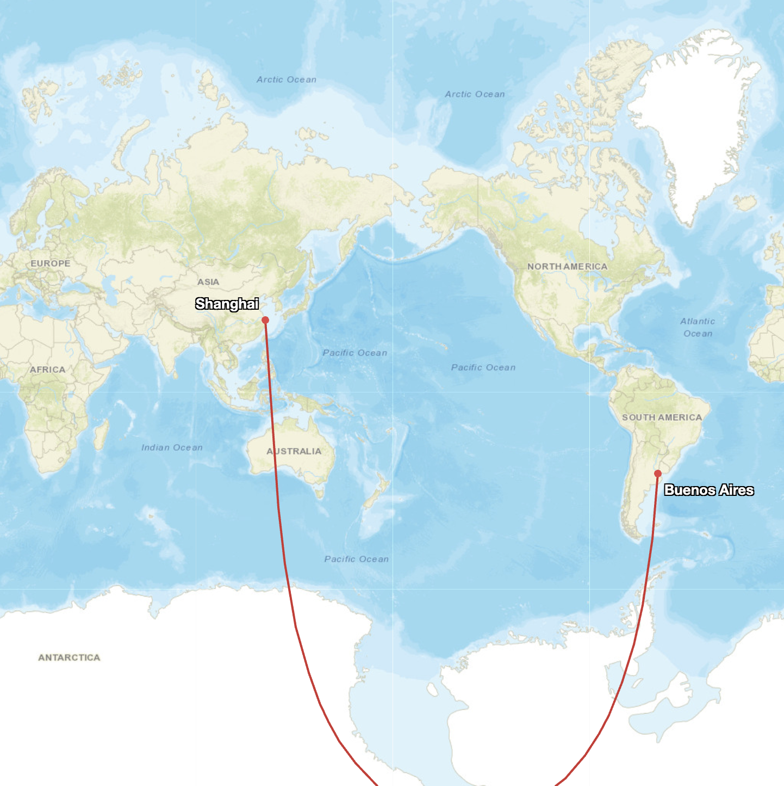
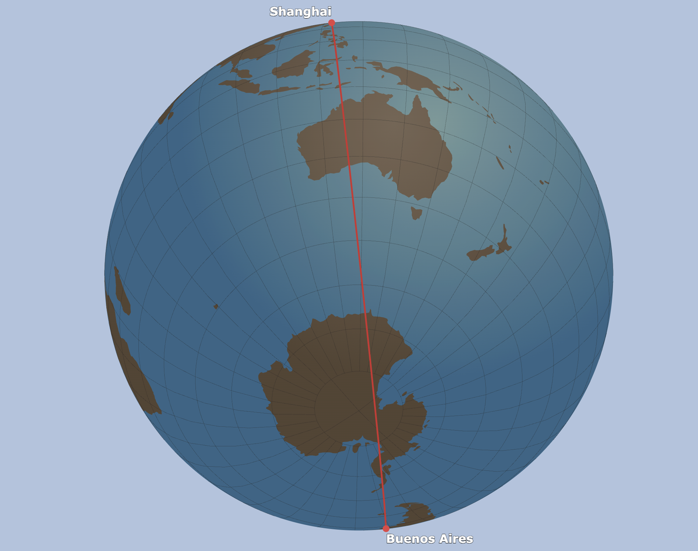

### Day 12 - Map from 2125
**[Challenge Description](https://30daymapchallenge.com/#:~:text=How%20will%20maps%20look%20100%20years%20from%20now%3F%20Create%20a%20speculative%20map%20of%20what%20might%20be%20(or%20what%20you%20hope%20will%20be)):** How will maps look 100 years from now? Create a speculative map of what might be (or what you hope will be).


### My Submission

I’m not the most creative person when it comes to picturing a cyberpunk 2125, nor do I have the cartographic skills to draw fancy maps. Supposing that the future is better than the past (hopefully or at least in some extent), I started thinking about what we still can’t do today–what is missing on today's maps. One idea came quickly: we still can’t fly nonstop to just anywhere on the planet. If the future really is better, then by 2125 our maps might finally include those ultra-long routes that are impossible right now.

#### How Far We Can Go Today

Right now, the longest commercial nonstop flights—like [Singapore to New York JFK (SQ23/24)](https://en.wikipedia.org/wiki/Longest_flights#By_great-circle_distance)—reach 15,349 km / 9,537 miles with a duration of 18:50. That’s already extreme for both pilots and aircraft (and customers!).

The aircraft used for these routes, such as the [A350-900ULR](https://crankyflier.com/2018/11/13/a-look-inside-the-singapore-airlines-a350-900ulr/), have a theoretical maximum range of around 18,000 km.

From Shanghai, the farthest true nonstop you can take is New York (JFK), about 11,867 km. Any major cities that are past that distance, today’s planes just don’t have enough fuel capacity.


#### The Utimate Flight Routes in 100 years

Now imagine planes in 2125 with bigger fuel tanks, better engines, and faster cruise speeds.

A route that is impossible today might be routines on that map:

```
Shanghai (PVG) → Buenos Aires (EZE)
Distance: 19,595 km, Time (est.): 21h 24m. 
```
Almost [antipodal](https://en.wikipedia.org/wiki/Antipodes)—one of the farthest major city pairs on the planet.

<p style="text-align:center;">
  
  
</p>

<p style="text-align:center;">

</p>


#### Reality Check: How Much Improvement Do We Need?

To make Shanghai → Buenos Aires work, we’d need aircraft that can fly roughly 30% farther than the current longest commercial flights.

Commercial flight range has grown from under 500 km in the 1920s to 11,000 km in the 1970s and now over 15,000 km, so a 30% jump to reach Shanghai → Buenos Aires (~19,600 km) in the next century seems realistic.

**Or in 100 years rockets will become commercialized and used for everyday transportation, and people then will look back on their history the same way we now look back on the history of airplanes.**


### References  
- Tool used: [Great Cricle Map](https://www.greatcirclemap.com/?routes=PVG-EZE)


*Made by [Matt Zhu](https://mattzhu.net) for the [#30DayMapChallenge](https://30daymapchallenge.com/).*
