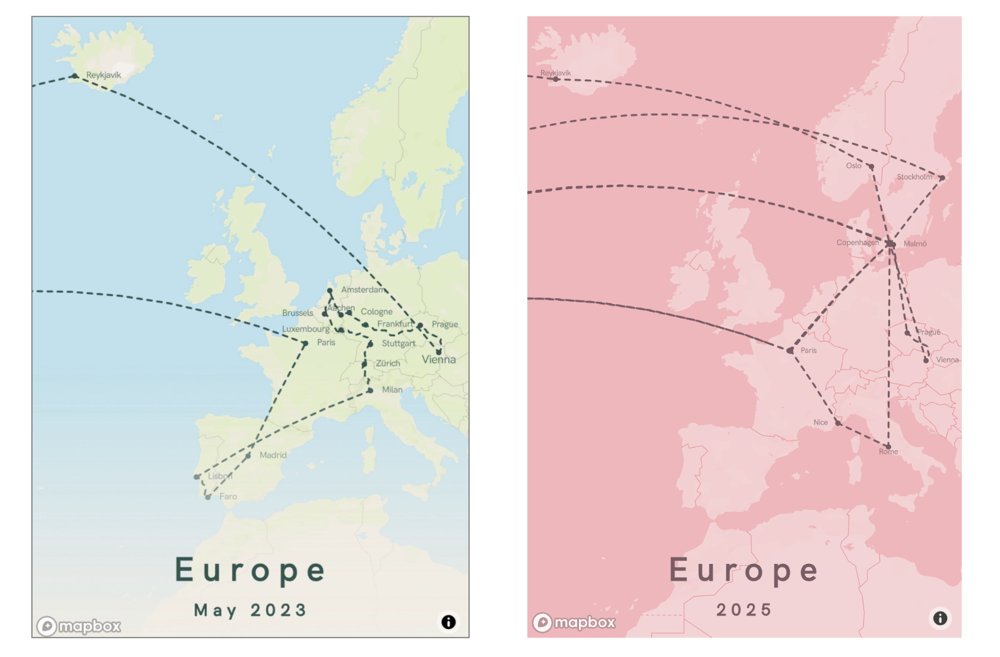

### Day 4 – My Data
**[Challenge Description](https://30daymapchallenge.com/#:~:text=Map%20something%20personal%20using%20your%20own%20dataset.%20Visualize%20GPS%20traces%2C%20your%20commute%2C%20or%20a%20unique%2C%20small%20dataset%20you%20created.%20(Need%20simple%20data%3F%20Try%20geojson.io)):** 	Map something personal using your own dataset. Visualize GPS traces, your commute, or a unique, small dataset you created. (Need simple data? Try [geojson.io](geojson.io))

### My Submission

In May 2023, I set out on a solo backpacking trip across 12 European countries. It was my first time exploring Europe on my own, and I made a map (below left) afterward to trace where I’d been.

Two years later, in 2025, I returned to Europe three times to visit my girlfriend while she was studying abroad. Using the same tool, I created another map (below right) to capture those journeys today.

Together, these two maps capture my journeys from both years.

(Overlapping lines represent flight paths I took multiple times.)

[Click here to view high-quality PDF ⬆️](../assets/day4.pdf)

### References  

- Tool to make the maps: [My Holiday Map](https://poster.myholidaymap.com/).

*Made by [Matt Zhu](https://mattzhu.net) for the [#30DayMapChallenge](https://30daymapchallenge.com/).*
