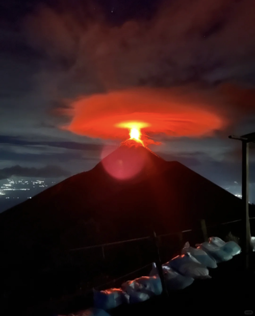
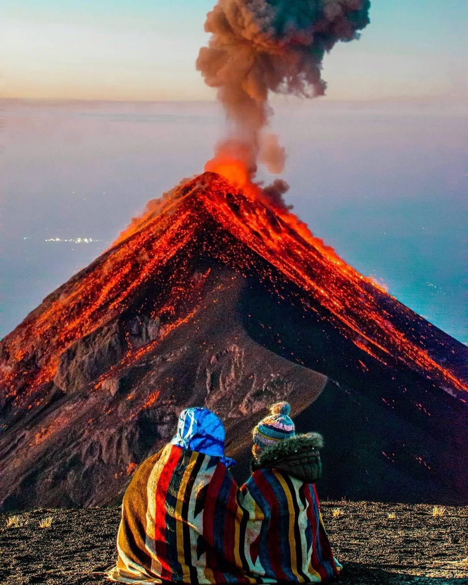
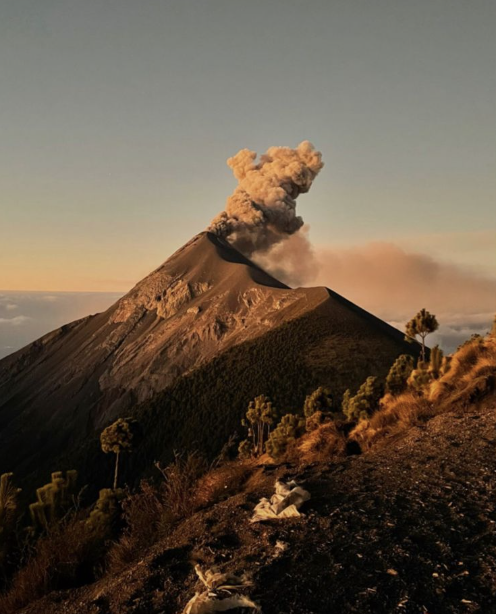
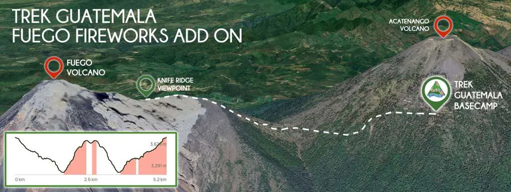

### Day 5 – Earth 🌎
**[Challenge Description](https://30daymapchallenge.com/#:~:text=Classical%20Elements%20%C2%BC%3A%20Focus%20on%20the%20tangible%20and%20grounded.%20Map%20landforms%2C%20geology%2C%20soil%2C%20agriculture%2C%20elevation%2C%20or%20anything%20solid%20beneath%20your%20feet.):** 	Focus on the tangible and grounded. Map landforms, geology, soil, agriculture, elevation, or anything solid beneath your feet.

### My Submission 🌋

I’ve always thought 3D maps looked super cool, but also kind of hard to make. While browsing fun creations from the *#30DayMapChallenge* on [Twitter/X](https://x.com/hashtag/rayshader), I came across an amazing R library called [rayshader](https://www.rayshader.com/) developed by [Tyler Morgan-Wall](https://x.com/tylermorganwall). It’s incredibly powerful and can generate some stunning visualizations. I also discovered a plugin called [rayvista](https://github.com/h-a-graham/rayvista), which makes data retrieval and 3D modeling so much easier — literally just one line of code.

I definitely want to explore more with `rayshader` moving forward, but to start off, I made the two maps below using `rayvista`, featuring the [Fuego](https://en.wikipedia.org/wiki/Volc%C3%A1n_de_Fuego) and [Acatenango](https://en.wikipedia.org/wiki/Acatenango) volcanoes in Guatemala. I’ll be visiting them this Thanksgiving (counting down the days!).

In each image, the left volcano is Fuego covered with grey ash; the right one is Acatenango. The two images show the same scene from different camera angles.

<p style="text-align:center;">
  
  
</p>

### About Fuego and Acatenango

Fuego (see [location](https://maps.app.goo.gl/fC5SpR6pc2C8dUzN7) and [images](https://www.google.com/search?sca_esv=7996920a3193b21b&sxsrf=AE3TifNcJWB3BfbILZCYl74RBX5D1z166Q:1762399851813&udm=2&fbs=AIIjpHxU7SXXniUZfeShr2fp4giZ1Y6MJ25_tmWITc7uy4KIeuYzzFkfneXafNx6OMdA4MQRJc_t_TQjwHYrzlkIauOKPY6AGi5WlEHM84Wm0PfFv70IbKvZ_YnHj3eN61I0ViwY4pnH5uK4ilKEYbr10BasAB18Gd26kqtjoHn0TUTLUlGrGq7E_Ejk1GThF6IEOPGrHhu8FQnG8PdAcpqey5cGUAElYQ&q=Volc%C3%A1n+de+Fuego&sa=X&ved=2ahUKEwifkvqIy9yQAxV0FlkFHY68I6AQtKgLegQIERAB&biw=1440&bih=788&dpr=2)) is an active volcano — you can actually see its lava glowing at night.

Acatenango (see [location](https://maps.app.goo.gl/A8DTdz5yzV5Hab1S9) and [images](https://www.google.com/search?sca_esv=7996920a3193b21b&sxsrf=AE3TifMHKMxxSTr-o74_yoOWTnITe4VPBA:1762399898361&udm=2&fbs=AIIjpHxU7SXXniUZfeShr2fp4giZ1Y6MJ25_tmWITc7uy4KIeuYzzFkfneXafNx6OMdA4MRo3L_oOc-1oJ7O1RV73dx3MIyCigtuiU2aDjExIvydX17etG1w5v2C3lSOdVq_SatqEYIiMuFhygAHxKTpzVMJuNMidVhUTCtypBeMeRxxXIwn8ffBnxDa0ghwP6drGT5ooI1nnOCb2NWS44T6QwxM4onrww&q=acatenango&sa=X&ved=2ahUKEwjZlZOfy9yQAxXwGlkFHVYVEc4QtKgLegQIFBAB&biw=1440&bih=788&dpr=2)), right next to it, is dormant.

The usual hiking route is to climb Acatenango first and camp overnight at its basecamp there. Then, around 4 a.m. the next day, hikers go down a bit and continue up Fuego to watch it erupt up close.


<p style="text-align:center;">
  
  
  
</p>


<p style="text-align:center;">

  
</p>

(Above images are from the internet.)


### R Code Snippet
Since it's super simple to make, I'm sharing the code below:

```{r}
# Suppose you’ve already installed the packages
library(rayvista)
library(rayshader)

# --- First map (left) ---
plot_3d_vista(
  lat = 14.489341,
  long = -90.877826,
  radius = 5000,      # meters
  z = 5,              # DEM detail level
  theta = 125,        # direction
  phi = 25,           # camera angle
  zoom = 0.8
)

render_snapshot(
  filename = "fuego_acatenango_1.png",
  clear = TRUE,
  title_text = NULL,
  width = 4000,
  height = 4000,
  background = "white"
)

# --- Second map (right) - higher viewpoint ---
plot_3d_vista(
  lat = 14.489341,
  long = -90.877826,
  radius = 4500,      # meters
  z = 5,              # DEM detail level
  theta = 125,        # direction
  phi = 55,           # higher angle
  zoom = 0.8
)

render_snapshot(
  filename = "fuego_acatenango_2.png",
  clear = TRUE,
  title_text = NULL,
  width = 4000,
  height = 4000,
  background = "white"
)

# I tried many times to find the view I liked the most!

```

### References  

* [rayshader](https://www.rayshader.com/)
* [rayvista](https://github.com/h-a-graham/rayvista)
* Twitter X user [@researchremora](https://x.com/researchremora)


*Made by [Matt Zhu](https://mattzhu.net) for the [#30DayMapChallenge](https://30daymapchallenge.com/).*
