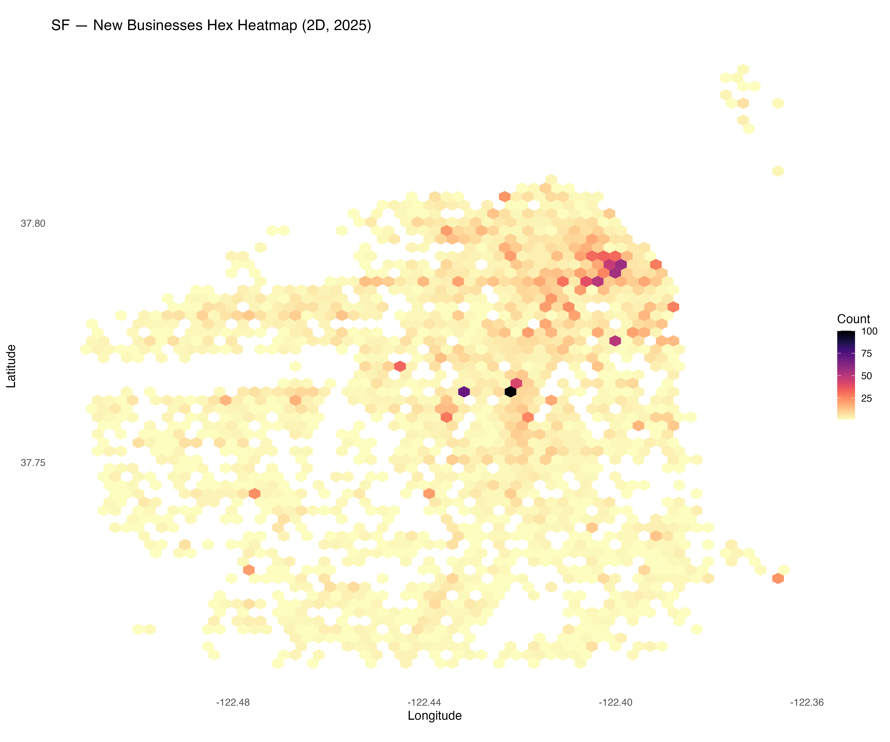
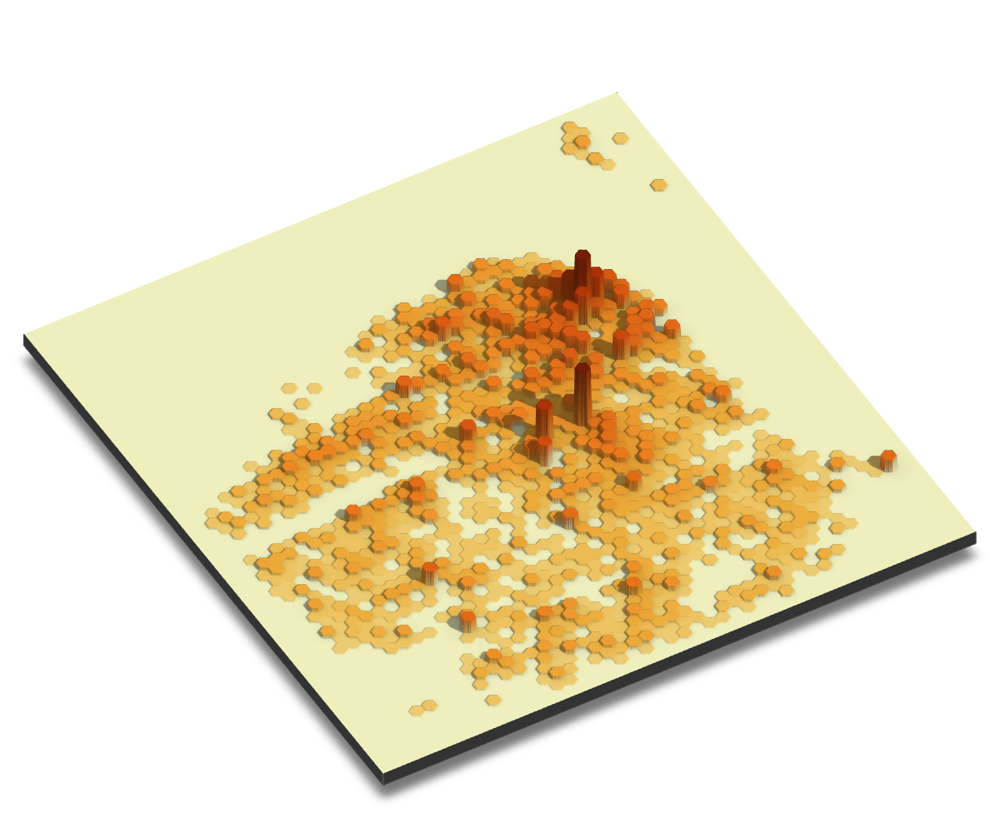

### Day 6 – Dimensions
**[Challenge Description](https://30daymapchallenge.com/#:~:text=Map%20beyond%202D.%20Visualize%20data%20using%203D%20models%2C%20extrusions%20(building%20heights)%2C%20depth%2C%20time%20(as%20a%20dimension)%2C%20or%20an%20unconventional%20multivariate%20approach.):** Map beyond 2D. Visualize data using 3D models, extrusions (building heights), depth, time (as a dimension), or an unconventional multivariate approach.

### My Submission

2D Hex Heatmap & 3D Hex Heightmap visualizing registered business locations in SF for 2025 so far.

(making slow progress with `rayshader`)

  
  

### References  

* Source: [DataSF | Open Data Portal](https://data.sfgov.org/Economy-and-Community/Map-of-Registered-Businesses-San-Francisco/9tqe-vdng)
* [rayshader](https://www.rayshader.com/)

*Made by [Matt Zhu](https://mattzhu.net) for the [#30DayMapChallenge](https://30daymapchallenge.com/).*
